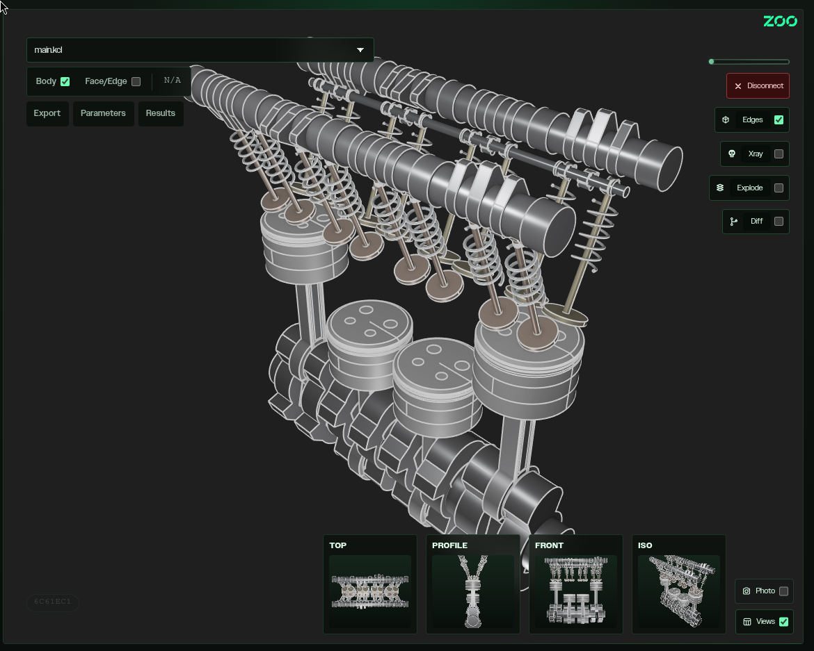
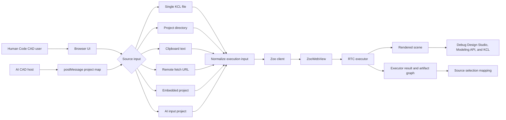
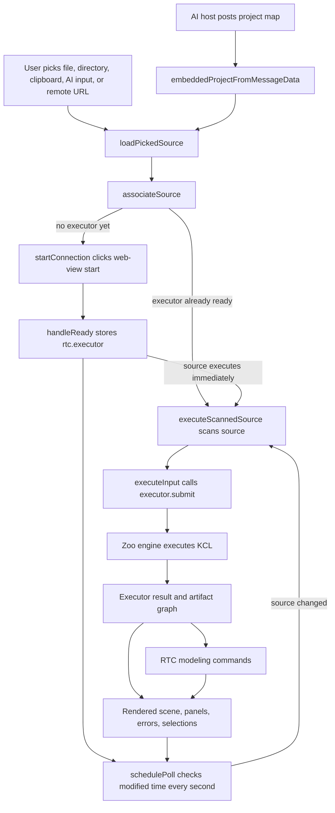

# Zoo Viewer

Zoo Viewer is a browser app for loading
[KCL](https://docs.zoo.dev/docs/kcl) projects, connecting them to the
[Zoo modeling service](https://docs.zoo.dev), and inspecting the rendered
model.



## Purpose

### Code CAD

The primary purpose of this application is to make Code CAD practical to
debug. A user can open a KCL file or project directory, edit source locally,
and see the Zoo-rendered model update when the source changes.

### AI CAD

The app is also designed for AI CAD workflows. Generated KCL can enter
through the AI input panel, remote fetch URLs, or the embedded `postMessage`
API.

### Debugging Facility

The viewer exposes enough runtime state to understand what happened during
execution. It helps debug Zoo Design Studio, the Zoo modeling API, and KCL
execution behavior.

Useful debugging surfaces include KCL execution errors, top-level values,
artifact mapping, source selections, scene commands, snapshots, exports, and
raw executor results.

## Setup

Prerequisites:

- Node.js and npm.
- `make`, used by the npm scripts.
- A modern browser. Chrome and Edge get the best File System Access API
  experience; other browsers use file input fallbacks.
- A Zoo API key for local development, available from the
  [Zoo account developer tab](https://zoo.dev/account).

Install dependencies from the lockfile:

```sh
npm ci
```

## Run Locally

Start the development server:

```sh
npm run serve
```

The serve workflow builds the app, copies the required KCL WASM asset,
serves `public/`, watches `src/main.ts`, enables CORS for local embedding,
and listens at `http://127.0.0.1:3000`.

For local runs, paste a
[Zoo API key](https://docs.zoo.dev/docs/developer-tools) into the token
field before loading a source. The token is stored in `localStorage` as
`zoo-api-token` and is masked after entry.

## Build And Test

Create a production-style browser bundle:

```sh
npm run build
```

Run the jsdom test suite:

```sh
npm test
```

Before submitting changes, run both commands and verify behavior against
`SPECIFICATION.txt`.

## Runtime Behavior

### Authentication And Execution

The app mounts a `ZooWebView`, creates a Zoo API client pointed at the Zoo
API base URL documented in the [Zoo API reference](https://api.zoo.dev),
and executes selected [KCL](https://docs.zoo.dev/docs/kcl) through the web
view executor.

On `viewer.zoo.dev`, it uses OAuth with the configured viewer redirect URL.
On localhost-style hosts, it uses the explicit API key flow. OAuth at the time
of writing is not generally available to developers. Prefer the API key flow
for now.


### Source Inputs

Supported source inputs:

- Single `.kcl` file.
- Project directory with an active entry file selector.
- Clipboard text.
- AI input panel with a small multi-file KCL editor.
- Remote file or archive loaded from `?fetch=<url>`.
- Embedded projects sent by `window.postMessage` as an object or JSON string:

```js
{ action: 'load', project: { 'main.kcl': '...' } }
```

Remote `fetch` URLs can point to a single KCL file or an archive. Archive
roots are normalized before rendering. If a remote request fails with a
browser fetch error, the UI explains the likely CORS issue.

### Live Reload

Live reload is intentionally simple. For file and directory sources, the app
polls the browser file system every second, compares the latest modification
time, and reruns KCL when the source changes.

This gives Code CAD a responsive edit-render loop without requiring a
separate watcher server or build pipeline.

### AI CAD PostMessage API

The embedded `postMessage` loader is an ad-hoc API for AI CAD hosts. A host
page can post a project map into the iframe, and the viewer treats it like a
browser directory source.

This keeps AI-generated KCL easy to preview without coupling the AI tool to
Zoo Viewer internals.

## Technical Architecture

### Main Components

This application combines browser APIs, Zoo APIs, KCL execution, and DOM
safety in one small app.

- Zoo authentication: local development creates a `zoo.Client` with a
  [Zoo API key](https://docs.zoo.dev/docs/developer-tools); hosted usage
  uses OAuth with the viewer redirect URL and `modeling` scope.
- Zoo rendering: `ZooWebView` owns the live modeling session and exposes the
  RTC executor once the web view is ready.
- KCL execution: the app submits either a single
  [KCL](https://docs.zoo.dev/docs/kcl) string or a `Map<string, string>`
  project to `executor.submit`.
- Modeling commands: after execution, the app sends RTC `modeling_cmd_req`
  and `modeling_cmd_batch_req` messages for `zoom_to_fit`, camera changes,
  snapshots, selection filters, point selection, xray/edge state, explode
  transforms, and `export3d`.
- Source mapping: executor results and artifact graphs are kept on
  `window.zooExecutorResult` for tooling and are used to map selected
  bodies, faces, and edges back to KCL source ranges.
- Browser integration: File System Access APIs support one-second live reload
  polling and the optional `websocket.pipe` bridge; regular file inputs
  provide a fallback for unsupported browsers.
- Safety layer: the centralized DOMPurify `innerHTML` setter sanitizes markup
  assigned by the app while preserving the existing rendering approach.

Command shapes can be explored in the
[Zoo API reference](https://api.zoo.dev).

### Single-File Structure

Most of the application currently lives in `src/main.ts`. That is intentional
for this application.

The viewer has many tightly coupled runtime workflows, and keeping them
together makes the full source-to-render path easy to inspect without jumping
between abstractions. The file shows browser inputs, Zoo client setup,
web-view lifecycle, executor calls, modeling commands, UI state, and result
handling in one place.

A future production cleanup could split out stable seams such as source
loading, RTC commands, selection mapping, and panels. This version favors
end-to-end readability and minimal indirection while the workflows are still
evolving.

### Initial Rendering

The [Zoo API](https://api.zoo.dev) is used for more than initial rendering:
it drives authentication, WebRTC session creation, KCL execution, scene
queries, camera control, selection, snapshots, and export downloads.

Initial rendering uses the Zoo API in two layers. First, the app creates an
authenticated Zoo client and gives it to `ZooWebView`, which establishes the
live modeling session and owns the rendering surface.

Second, once the web view reports `ready`, the app takes the RTC executor
exposed by the web view and submits the selected KCL source with the correct
entrypoint. The Zoo engine compiles and executes that source, streams
modeling responses back through the session, and produces the scene shown in
the embedded viewer.

### App Control Vs WebView Delegation

The split between fine control and delegated behavior is intentional.

The app keeps fine control over product-specific behavior: choosing where KCL
comes from, normalizing single-file versus project inputs, selecting the
active project entrypoint, storing executor results, mapping scene selections
back to source, deciding when to run `zoom_to_fit`, requesting snapshots, and
issuing export or selection commands.

`ZooWebView` handles the specialized lower-level work that should not be
reimplemented in the app: authenticated WebRTC setup, engine lifecycle,
rendering, video/canvas presentation, executor access, and transport of
modeling commands and responses.

That combination makes the application both flexible and robust. The app can
build custom workflows around files, directories, remote projects, AI input,
diffing, source previews, and exports, while still delegating the hard CAD
execution and real-time rendering path to Zoo's maintained web-view stack.

### Mobile Gestures

Mobile gesture support is deliberately ad-hoc. The app listens for browser
touch events, interprets one finger as rotate and two fingers as pan plus
pinch zoom, then sends the equivalent Zoo camera modeling commands over the
RTC channel.

This is not a full gesture framework; it works because Zoo's command path is
fast enough for these small camera updates to feel interactive. That
responsiveness lets the app add a thin mobile control shim without owning the
renderer or rewriting the web-view input system.

### Architecture Diagrams

The first diagram shows who can feed KCL into the viewer. The second follows
the actual source-to-render path in `src/main.ts`.





## App Workflows

### Loading And Editing

- Load and render: choose a file, directory, clipboard, remote source,
  embedded project, or AI input, then the app connects to the
  [Zoo service](https://docs.zoo.dev) and renders the result.
- Live reload: edit a file or directory project locally; the viewer polls
  once per second and rerenders when the source changes.
- AI CAD embedding: post a project map into the viewer to render generated
  projects through a tiny integration API.
- Directory projects: switch the active KCL file from the project selector;
  the app reruns the directory source with that entrypoint.

### Inspection And Debugging

- Parameters and results: after execution, open `Parameters` to adjust
  supported top-level values and `Results` to inspect returned values and
  structures.
- Selection mapping: click bodies, faces, or edges to map scene selections
  back to source ranges; open the selection pill to preview the relevant KCL.
- Diff mode: compare the current model against the original source, another
  project, another file, or clipboard contents.
- Websocket bridge: directory projects may include `websocket.pipe`; when
  present, the app polls it, sends its contents over RTC, and writes
  responses back. If `errors.log` exists, bridge and execution errors are
  appended there.

### Viewing And Exporting

- Export: use `Export` to download STEP, STL, OBJ, PLY, GLB, glTF, or FBX
  from the current scene through Zoo modeling export commands.
- Scene controls: toggle edge visibility, xray mode and opacity, explode
  modes, snapshot rail, and photo/no-UI mode.
- Snapshots: use Top, Profile, Front, and Iso snapshot cards to orient the
  main view.
- Mobile gestures: one-finger touch rotates; two-finger touch pans and
  pinch-zooms. This is an app-side shim that translates touches into Zoo
  camera commands, and it depends on the low latency of Zoo's RTC API to feel
  responsive.

## Security Mitigation

The DOM XSS mitigation in `SPECIFICATION.txt` is intentionally narrow.
`dompurify` is installed as a runtime dependency, and `src/main.ts` installs
a single centralized `innerHTML` setter hook before app rendering so assigned
markup is sanitized before insertion.

The broader DOM-building approach remains unchanged. When changing rendering
or sanitizer behavior, preserve existing UI behavior, keep the hook
browser-only, and rerun `npm test` and `npm run build`.
